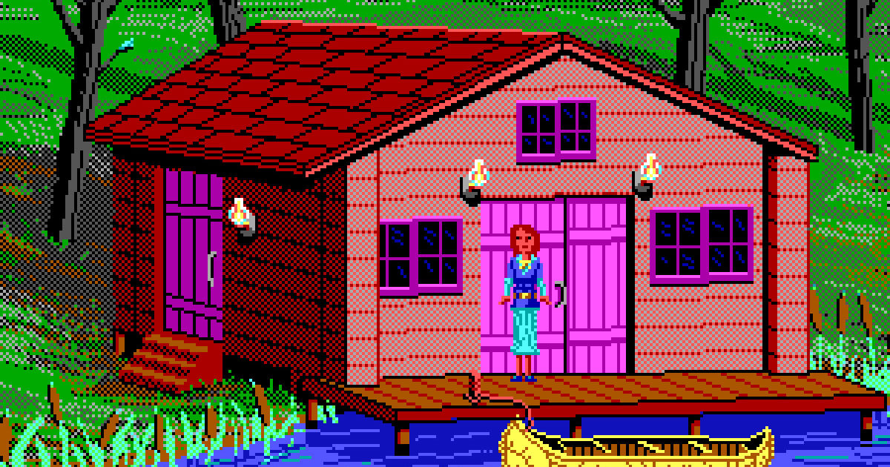

# :house_with_garden: The Crazy Apartment Hunt: A Berlin-inspired Adventure



### :green_book: Description
```
You are new in Berlin and are looking for a place to live. You found a listing in Mitte, applied to rent, and the 
landlord chooses you as a tenant! But there's one last thing
    ...you need to sign the Rental Contract.
    
        ... ... ...
        
You got your signing appointment with you landlord and you now need to figure out which route will lead you to your 
destination and arrive on time.
There are various ways to get to Mitte. Are you ready?
```


---
### :computer: Tools
`Python` `Data Types and Operators` `Strings` `If Statements` `Loops` `Lists` `Dictionaries`


---
### :page_with_curl: Credits
- [Photo](https://www.wired.com/2021/03/geeks-guide-adventure-games/)
